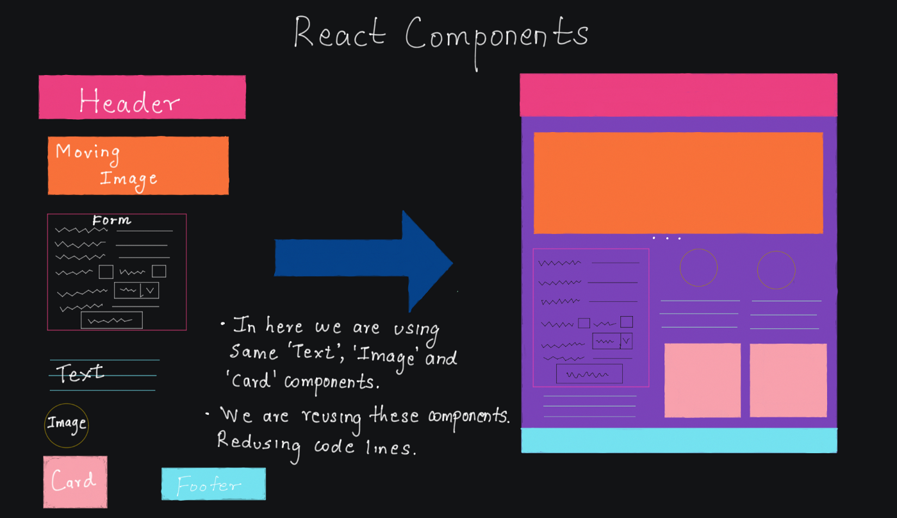
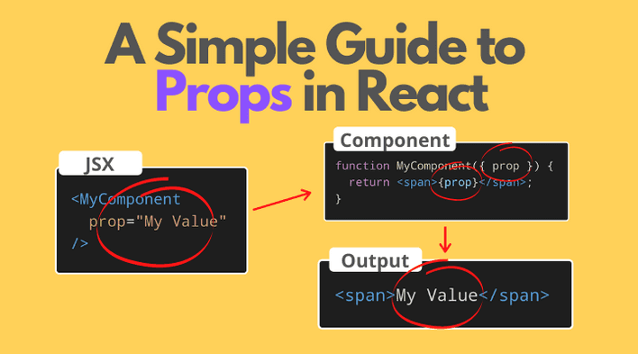
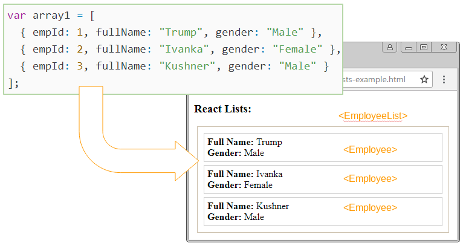

# Components 
## Components are independent and reusable bits of code.

# Props
## Props are the values that you pass down to your React component
# Handling Events
## Handling events with React elements is very similar to handling events on DOM element.
## There are some syntax differences: React events are named using camelCase, rather than lowercase. With JSX you pass a function as the event handler, rather than a string.

# Conditional Rendering
# Conditional rendering in React works the same way conditions work in JavaScript
# What is List and Key ?
## Keys help React identify which items have changed, are added, or are removed.


```JS
    const numbers = [1, 2, 3, 4, 5];
    const listItems = numbers.map((number) =>
        <li>{number}</li>
    );
    <ul>{listItems}</ul>
```
# We don’t recommend using indexes for keys if the order of items may change. This can negatively impact performance and may cause issues with component state. 